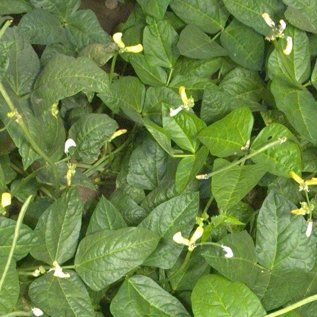
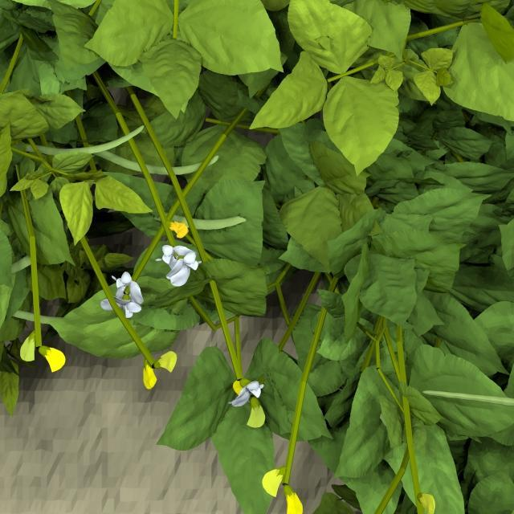
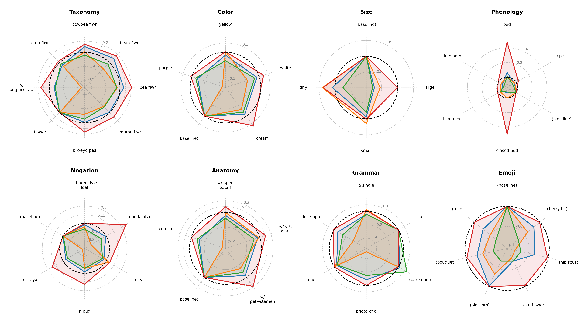
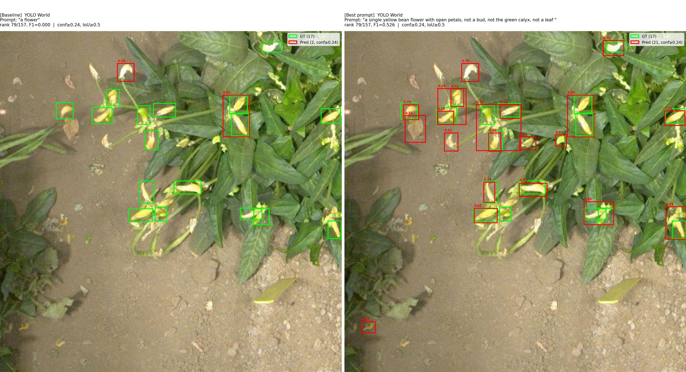

# AgVFM: Optimizing Vision Foundation Models for Agricultural Computer Vision Tasks

**Goal**: Optimize zero-shot capabilities of vision foundation models for application to agricultural tasks. This repository contains the code related to our submission to CVPR V4A 2026, [Does Your VFM Speak Plant? The Botanical Grammar of Vision Foundation Models for Object Detection](https://arxiv.org/abs/2604.09920), and continues to be developed to compare prompting strategies and transfer of prompts across crops, with a future interest in generalizing to other CV tasks. 

AgVFM, as implemented in [Does Your VFM Speak Plant? The Botanical Grammar of Vision Foundation Models for Object Detection](https://arxiv.org/abs/2604.09920), is an agronomic open-vocabulary / open-set detection experimentation pipeline centered on two stages:

- **Phase 1 (OFAT factor analysis):** isolate and score prompt factors (taxonomy, color, size, phenology, negation, anatomy, grammar, emoji).
- **Phase 2 (combinatorial search):** build and evaluate prompt combinations using the strongest Phase 1 signals, then expand with negation and emoji variants.

This pipeline, when applied to auto-labeled synthetic data from [Helios](https://github.com/PlantSimulationLab/Helios/) showed the potential to discover effective prompts for zero-shot object detection on real data.

Primary entry points:

- `experiments/scripts/experiments/load_and_run.py` for end-to-end batch runs.
- `notebooks/run_pipeline.ipynb` for interactive run/inspect/visualize workflow.

## Example data

The pipeline is developed and validated on cowpea flower and pod detection, using both real field imagery and synthetic renders as complementary evaluation sets.

| Real field image | Synthetic render |
|:---:|:---:|
|  |  |

Synthetic images provide dense, cleanly annotated training signal; real images test zero-shot transfer under natural variation in lighting and occlusion.

## Results

### Per-axis factor analysis (Phase 1)

The spider grid below shows mAP@0.5 for each prompt axis value across all models. Each subplot corresponds to one axis (Taxonomy, Color, Size, Phenology, Negation, Anatomy, Grammar, Emoji); the dashed circle marks the baseline value for that axis.



### Syn-to-real prompt optimization on real images (YOLO World)

The figure below shows YOLO World detections on the median-performing real image — baseline prompt (left) vs. the best prompt found by Phase 1 + 2 optimization on the synthetic set (right). The confidence threshold for both cases is selected from the optimal found on the synthetic dataset.



- **Baseline** — prompt: `"a flower"`
- **Optimized** — prompt: `"a single yellow bean flower with open petals, not a bud, not the green calyx, not a leaf"`

## Install

From the repo root, with `pip`:

```bash
pip install -e .
```

Or with [`uv`](https://docs.astral.sh/uv/):

```bash
# Install uv if not already installed
curl -LsSf https://astral.sh/uv/install.sh | sh

# Install project dependencies (reads pyproject.toml)
uv sync

# Optional: vLLM as a standalone tool, kept separate to avoid dependency
# conflicts — needed to serve the axis/template-generation LLM locally
# (see "Serving an LLM/VLM locally" below).
uv tool install vllm --with ninja --with "bitsandbytes>=0.48.1"
```

`agml` (for `agvfm/data/agml_loader.py`'s dataset loader, used by `run.py`,
`run_template.py`, `meta_run_template.py`, `meta_run.py`, and `grad_run.py`)
is installed automatically as a project dependency. Datasets are loaded from
the HuggingFace Hub via `agml.data.hf_loader.HuggingFaceDataLoader` (the
project has moved off the older `agml.data.AgMLDataLoader` streaming API) and
cache to `~/.cache/huggingface/` by default; pass `--agml-data-root` to
redirect a single run's cache elsewhere, or set `HF_HOME` for a global
redirect (see below). Dataset names can be given bare (e.g.
`grape_detection_californiaday`, resolved under the `Project-AgML` HF org) or
as a fully-qualified `org/name` HF repo id.

### Redirecting large downloads (datasets, model weights) to another drive

HF datasets, any model pulled through the local-HF-pipeline LLM/VLM backend
(below), and torch hub downloads can add up to tens of GB fast. To route all
of it somewhere other than the system drive, set these before installing/
running (PowerShell, persists across sessions):

```powershell
[Environment]::SetEnvironmentVariable("HF_HOME", "F:\agvfm-cache\huggingface", "User")
[Environment]::SetEnvironmentVariable("TORCH_HOME", "F:\agvfm-cache\torch", "User")
[Environment]::SetEnvironmentVariable("PIP_CACHE_DIR", "F:\agvfm-cache\pip", "User")
```

(For git-bash sessions, `export` the same three in `~/.bashrc` too — `User`-scope
Windows env vars only apply to newly spawned processes, not an already-running shell.)
Open a new terminal after setting these so the variables take effect. If
migrating an *existing* `~/.cache/huggingface` by hand, use `robocopy /E
/COPY:DAT` (PowerShell) rather than `mv` — HF's cache uses NTFS
symlinks/reparse points internally that plain `mv` across drives can mangle.

### LLM/VLM backends: served endpoint vs. local HuggingFace pipeline

`agvfm/llm/client.py` (`LLMClient`), `agvfm/llm/meta_client.py` (`VLMClient`),
and `agvfm/llm/vlm_insight_client.py` (`VLMInsightClient`) each support two
interchangeable backends, chosen per instance by whether `base_url` is given:

- **Served** (pass `--llm-url`/`--vlm-insight-url`) — any OpenAI-compatible
  chat completions endpoint, e.g. a local vLLM server. Lower per-call latency
  once running, and the only option for a shared/remote inference server.
- **Local HF pipeline** (omit `--llm-url`/`--vlm-insight-url`) — `--llm-model`
  / `--vlm-insight-model` is pulled from the HuggingFace Hub and run
  in-process via `transformers.pipeline` (`text-generation`, or
  `image-text-to-text` for `VLMInsightClient`). No server to stand up first;
  this is the same approach `load_and_run.py` uses for its Qwen/Qwen3-4B axis
  translation. Trades startup/load time and holding the model in memory for
  one fewer moving part.

Both options are available on every entry point that talks to an LLM/VLM
(`load_and_run.py`, `run.py`, `run_template.py`, `meta_run.py`,
`meta_run_template.py`) via the same `--llm-url`/`--llm-model`(/`--llm-device`)
and, where applicable, `--vlm-insight-url`/`--vlm-insight-model`
(/`--vlm-insight-device`) flags — omit the `*-url` flag to use the local
backend, or set it to use a served one.

#### Option A — serve locally with vLLM

```bash
# Text-only axis/template generation (small model)
vllm serve meta-llama/Llama-3.2-1B-Instruct \
    --quantization bitsandbytes \
    --load-format bitsandbytes \
    --max-model-len 32768 \
    --gpu-memory-utilization 0.4 \
    --port 8000

# Vision-capable, for meta_run_template.py's VLM template search and/or
# --vlm-insight-* zero-shot template fill (needs a vision-capable model)
vllm serve meta-llama/Llama-3.2-11B-Vision-Instruct \
    --quantization bitsandbytes \
    --load-format bitsandbytes \
    --max-model-len 32768 \
    --gpu-memory-utilization 0.7 \
    --port 8001
```

Then pass `--llm-url http://localhost:8000/v1 --llm-model meta-llama/Llama-3.2-1B-Instruct`
(and `--vlm-insight-url http://localhost:8001/v1 --vlm-insight-model ...` where relevant).

#### Option B — pull a model from HuggingFace and run it locally

No server needed — just point `--llm-model` (and/or `--vlm-insight-model`) at
a HF Hub id and omit the corresponding `*-url` flag:

```bash
python experiments/scripts/experiments/run.py \
    --agml-dataset grape_detection_californiaday --agml-classes grape --crop grape \
    --model owlv2 \
    --llm-model Qwen/Qwen3-4B --llm-device cuda
```

Any `transformers`-compatible causal LM works for `--llm-model`
(`text-generation` pipeline); any `transformers`-compatible VLM works for
`--vlm-insight-model` (`image-text-to-text` pipeline, e.g.
`Qwen/Qwen2-VL-7B-Instruct` or `google/gemma-3-4b-it`).

## Data and model weights

- **Images + labels:** point `--img-dir` and `--lbl-dir` at your evaluation set if using `load_and_run.py`, set macro in `run_pipeline.ipynb` otherwise.
- **Label formats:**
	- YOLO `.txt` labels are used directly.
	- COCO `.json` labels are auto-converted to YOLO format by `load_and_run.py`.
- **YOLO World weights:** place `.pt` files in `model_weights/` (or pass `--yolo-weights`).

## Main workflow (`load_and_run.py`)

Script: `experiments/scripts/experiments/load_and_run.py`

### What it does

1. Validates paths and loads test image list.
2. Converts COCO labels to YOLO format when needed.
3. Resolves factor axes from one of:
	 - `--axes-file` (explicit),
	 - existing `factor_axes.json` in results directory,
	 - LLM translation (Qwen3-4B) when crop text is provided,
	 - default built-in axes.
4. Runs Phase 1 and/or Phase 2 for one model or all models.
5. Optionally samples images via `--sample-size`, then re-validates the best prompt on full data.
6. Writes per-model JSON outputs plus a global best-prompt summary.

### Qwen factor-axis translation prompt

When crop text is provided (for `--run-ph1` and/or `--run-ph2`) and no prior axes file is reused, `load_and_run.py` calls Qwen (`Qwen/Qwen3-4B`) with a strict JSON-only prompt protocol.

System prompt behavior:

- Forces JSON-only output (no explanation, no chain-of-thought).
- Preserves axis names: `taxonomy`, `color`, `size`, `phenology`, `negation`, `anatomy`, `grammar`, `emoji`.
- Requires each axis object to contain exactly: `name`, `values`, `baseline`.
- Instructs grammar to remain unchanged.
- Requests realistic negation confounders and 3-5 relevant emoji values.

User prompt template behavior:

- Injects the target crop/object string.
- Injects the original cowpea-flower `FACTOR_AXES` JSON.
- Asks for translated `values` and `baseline` fields for each axis.

Expected output schema:

```json
[
	{
		"name": "taxonomy",
		"values": ["...", "..."],
		"baseline": "..."
	}
]
```

Validation and fallback behavior:

- The script strips accidental code fences and extracts the outer JSON array.
- If parsing or schema validation fails, it falls back to default built-in axes (problematic silent failure point as of now, so this should be changed; failures are avoided by ensuring Qwen avoids "thinking", but this was an issue before).
- Successful translations are saved to `factor_axes.json` in the results directory for reuse.

### Supported models (as of now)

- `yolo_world`
- `grounding_dino`
- `owlv2`
- `sam3`
- `all` (sequentially runs all models)

*Note*: Other models can be added as desired by adding their necessary functionality to a `AgVFM/agvfm/models/{MODEL_NAME}.py` file and adding imports and logic to the Phase 1 + 2 analysis scripts.

### Example commands

Run full Phase 1 + 2 on all models:

```bash
python experiments/scripts/experiments/load_and_run.py \
	--run-ph1 "cowpea flower" \
	--run-ph2 "cowpea flower" \
	--model all \
	--img-dir data/all_flower_test \
	--lbl-dir data/all_flower_test \
	--results-dir experiments/results/load_and_run/SYN-FLOWER \
	--device cuda
```

Fast debug run on a sample:

```bash
python experiments/scripts/experiments/load_and_run.py \
	--run-ph1 "cowpea flower" \
	--run-ph2 "cowpea flower" \
	--model yolo_world \
	--img-dir data/all_flower_test \
	--lbl-dir data/all_flower_test \
	--sample-size 200
```

Reuse existing axes and run only Phase 2:

```bash
python experiments/scripts/experiments/load_and_run.py \
	--run-ph2 "cowpea flower" \
	--axes-file experiments/results/load_and_run/SYN-FLOWER/factor_axes.json \
	--model grounding_dino \
	--img-dir data/all_flower_test \
	--lbl-dir data/all_flower_test
```

## Cross-dataset template workflow (`run.py`, `run_template.py`, `meta_run_template.py`)

Scripts: `experiments/scripts/experiments/{run,run_template,meta_run_template}.py`

`load_and_run.py` above optimizes and reports a prompt per single dataset. These
three scripts extend the same axis/prompt-optimization machinery across
*many* datasets at once, in line with the shift described in `PAPER.md`: from
dataset-by-dataset runs with a final cross-dataset comparison, to discovering
one prompt (or template) against a pooled training set and transferring it
zero-shot to crops the search never saw.

- **`run.py`** — the single-dataset axis-based optimizer (OFAT + Table 2
  combinatorial sweeps + negation + emoji), generalized beyond the
  cowpea-flower-specific `FACTOR_AXES` via `agvfm.optimizer.axes.PromptAxes`
  so it runs against any AgML dataset or on-disk directory
  (`--agml-dataset`/`--agml-classes` or `--img-dir`/`--lbl-dir`/`--classes`).
  Same algorithm shape as `load_and_run.py`'s Phase 1 + 2; kept as a separate
  entry point since it targets one dataset per invocation rather than a pool.
- **`run_template.py`** — pools ~N images per class across every *train*
  dataset in a `--datasets-file` YAML (see
  `experiments/scripts/experiments/datasets_pool.example.yaml`), runs the same
  OFAT sweep against the pooled mix so the winning axis values generalize
  across crops rather than overfitting one, then evaluates the resulting
  template **zero-shot** (no further tuning) on every dataset flagged
  `held_out: true` in that file — filled from bare class/crop metadata and,
  optionally, from a VLM's visual read of a held-out sample image
  (`--vlm-insight-url`/`--vlm-insight-model`).
- **`meta_run_template.py`** — the unconstrained counterpart to
  `run_template.py`: instead of sweeping axis values, an LLM proposes
  free-text *templates* (strings containing a literal `"{class}"`
  placeholder) scored against the same pooled training mix, with a
  `CrossRunSummary` carried across models so later runs can be informed by
  what won for earlier ones without touching the held-out data.

Both template scripts require `--llm-url`/`--llm-model` (template/axis-value
generation) and support the same model/device flags as `run.py`. Only AgML
datasets are supported for the training pool (pooling many on-disk
directories at once wasn't a near-term need); see each script's module
docstring for full usage and the `--datasets-file` schema.

## Full comparison pipeline (`run_full_pipeline.py`)

Script: `experiments/scripts/experiments/run_full_pipeline.py`

This is the paper's central-comparison entry point: for every requested
model, it runs discovery (`run_template.py`'s job) + constrained transfer +
metaprompting (summary-informed, zero-shot; `meta_run_template.py`'s job)
against the *same* pooled training mix and held-out split from one
`--datasets-file`, logs every condition through
`agvfm.instrumentation.tracking.RunTracker`, and ends by writing the
aggregated cost/performance comparison table (`agvfm.reporting.aggregate`) —
`<output-dir>/comparison_table.csv`, plus a printed summary.

```bash
python experiments/scripts/experiments/run_full_pipeline.py \
    --datasets-file experiments/scripts/experiments/datasets_pool.example.yaml \
    --llm-url http://localhost:8000/v1 --llm-model meta-llama/Llama-3.2-1B-Instruct \
    --model yolo_world owlv2
```

Pass `gemma4` in `--model` (see below) to add the VLM-as-unified-pipeline
condition alongside the open-vocab detectors. Deliberately out of scope for
this script (see `AGENT.md`): metaprompt cold-start, single-dataset axis
search (`run.py`), and the PEZ/LoRA gradient baselines — those target one
dataset at a time rather than the cross-dataset benchmarking this pipeline
is for.

### Instrumentation and reporting

- `agvfm/instrumentation/tracking.py` — `CallRecord` (the structured per-run
  schema: dataset/model/method/prompt_space/pipeline_role,
  wall-clock/tokens/$/GPU-hours/labeled-examples, performance) and
  `RunTracker`, which appends records to a JSONL log. `agvfm/llm/{client,
  meta_client,vlm_insight_client}.py` all track cumulative call/token/time
  usage internally (`.usage_snapshot()`); `agvfm/optimizer/{prompt_template,
  meta_prompt_template}.py` record per-axis / per-iteration timing and
  (for the metaprompt search loop) per-iteration token/call cost, not just a
  final summary.
- `agvfm/reporting/aggregate.py` — reads a whole results-directory tree of
  `*.jsonl` logs, groups by (dataset, method, model, prompt_space, rarity),
  and writes the paper's comparison table. Also usable standalone:
  `python -m agvfm.reporting.aggregate --logs-dir experiments/results/full_pipeline`.

### Gemma 4 unified pipeline (`agvfm/models/vlm_pipeline.py`)

`Gemma4VLMPipeline` implements PAPER.md section 3.6: one Gemma 4 instance
performs prompt generation (`"constrained"` — fills a discovered axis
template itself; `"unconstrained"` — freely proposes a prompt) **and** the
grounding/detection step, rather than handing a prompt to a separate
detector. A `"raw"` mode also exists for benchmarking Gemma 4 as a
detection-only backend against an externally-supplied prompt.

Its grounding output format (a JSON array of `{"box_2d": [...], "label":
...}` per detection, coordinates normalized to a 1000x1000 space) was
confirmed against Gemma 4's public launch material before writing this
module, not assumed — but the exact `box_2d` axis order (`[ymin, xmin, ymax,
xmax]`, inherited from Gemini's established convention) has **not** been
verified against a live model call in this environment. Confirm it before
trusting box coordinates from a real run — see `AGENT.md`. Gemma 4 also
doesn't natively emit a per-box confidence score; this module asks for one
via the prompt schema and falls back to a fixed `1.0` when omitted, which
degenerates a precision-recall sweep to a single point — a documented
approximation, not a model capability.

Supports the same served-vLLM-vs-local-HuggingFace-pipeline backend choice
as the `llm/` clients (`--gemma4-url`/`--gemma4-model`/`--gemma4-device` on
`run_full_pipeline.py`).

## Notebook workflow (`run_pipeline.ipynb`)

Notebook: `notebooks/run_pipeline.ipynb`

The notebook is designed to:

1. Configure paths and run tags.
2. Optionally launch `load_and_run.py` (toggle with `RUN_PIPELINE=True`).
3. Load Phase 1/2 JSON artifacts.
4. Produce primary visual summaries:
	 - spider summary grid,
	 - per-axis spider comparisons.
5. Produce secondary comparisons:
	 - per-model all-metrics factor contributions,
	 - GroundingDINO vs OWLv2 comparisons,
	 - four-model comparison plots.
6. Build a prompt discovery table (Phase 1 vs Phase 2 best prompts).
7. Optionally generate median-image qualitative overlays (baseline prompt vs best prompt).

## Output artifacts

Key outputs written under your `--results-dir` include:

- `ph1_<model>_factor_analysis.json`
- `ph2_<model>_combinations.json`
- `best_prompt_fulldata_<model>.json` (when sampling is used)
- `best_prompt_summary.json`
- `factor_axes.json` (when axes are translated/saved)

Notebook visualization exports are saved under:

- `experiments/results/notebook_visualizations/<RUN_TAG>/`

## Notes

- Current analysis defaults focus on IoU=0.5 for ranking/reporting; for scenarios requiring stricter bounding boxes, IoU for mAP calculation can be increased.
- `--map-coco` is optional and adds  `mAP@0.5:0.95` computation; by default, ranking/reporting remains based on mAP@0.5. Enabling this is a good option for punishing loose bounding boxes.
- If no crop text is provided for a phase, default axis definitions are used.

## Package layout

- `agvfm/`: core package.
  - `models/`: YOLOWorldModel, GroundingDINOModel, OWLv2Model, SAM3Model (file-path/numpy `BaseModel` interface, used directly by `load_and_run.py`); `vlm_pipeline.Gemma4VLMPipeline` (VLM-as-unified-pipeline, PAPER.md 3.6 — same `BaseModel` interface).
  - `experiments/`: `Evaluator` (full mAP), `run_factor_analysis`.
  - `config/experiments.py`: `FACTOR_AXES`, prompt builders, `FactorAxis` (cowpea-flower-specific; the single-dataset baseline).
  - `llm/`: `LLMClient` (OpenAI-compatible axis-value generation), `meta_client.VLMClient` (free-text prompt/template suggestions), `vlm_insight_client.VLMInsightClient` (visual attribute reads for zero-shot template fill) — all three support a served-or-local-HF-pipeline backend choice and track cumulative call/token/time usage.
  - `instrumentation/tracking.py`: `CallRecord` + `RunTracker` — structured cost/performance logging (PAPER.md section 5).
  - `reporting/aggregate.py`: aggregates `RunTracker` logs into the cost/performance comparison table (PAPER.md section 5.3).
  - `optimizer/`: `AgVFMAdapter` + `VFMBase` bridge and `PromptAxes` (generalized, cross-dataset axis representation, in `types.py`/`axes.py`); `loop.py` (single-dataset axis-based OFAT + combinatorial search, generalized version of `load_and_run.py`'s Phase 1/2); `prompt_template.py` / `meta_prompt_template.py` (cross-dataset template discovery + zero-shot transfer — axis-based and LLM-based respectively); `meta_prompt.py` (single-dataset meta-prompt search + `CrossRunSummary`); `grad_prompt.py` + `grad_adapters.py` (PEZ gradient optimizer, **experimental**).
  - `data/`: `agml_loader.py` (Project-AgML datasets via the HuggingFace Hub, `agml.data.hf_loader.HuggingFaceDataLoader`), `disk_loader.py` (YOLO on-disk datasets).
- `experiments/scripts/experiments/`: experiment runners.
  - `load_and_run.py` — Phase 1 + 2 OFAT / combinatorial search on a single on-disk dataset (primary entry point).
  - `run.py` — single-dataset axis-based optimizer generalized to AgML/disk datasets via `PromptAxes`.
  - `run_template.py` — cross-dataset axis/template discovery + zero-shot transfer (pools training datasets, see `datasets_pool.example.yaml`).
  - `meta_run_template.py` — cross-dataset LLM template search + zero-shot transfer (unconstrained counterpart to `run_template.py`).
  - `run_full_pipeline.py` — orchestrates discovery + constrained transfer + summary-informed metaprompting (+ optional Gemma 4) in one run, with full instrumentation and a final comparison table.
  - `grad_run.py` — PEZ gradient prompt optimization (**experimental**).
  - `meta_run.py` — single-dataset LLM-iterative meta-prompt optimization (**experimental**).
- `notebooks/`: interactive analysis and reporting notebooks.
- `figures/`: result visualizations referenced in this README.

## Related documents

- `PAPER.md` — refactor spec for the cross-dataset prompt-transfer paper (axis-based constrained transfer vs. open-ended metaprompting, cost/instrumentation requirements).
- `agml_prompt_readme.md` — documentation for the original `agml_prompt` sibling repo that `run.py`/`run_template.py`/`meta_run_template.py`/the `agvfm/optimizer` and `agvfm/llm` modules above were ported and reconciled from.
- `AGENT.md` — current state of the reconciliation between the two repos and next steps.
